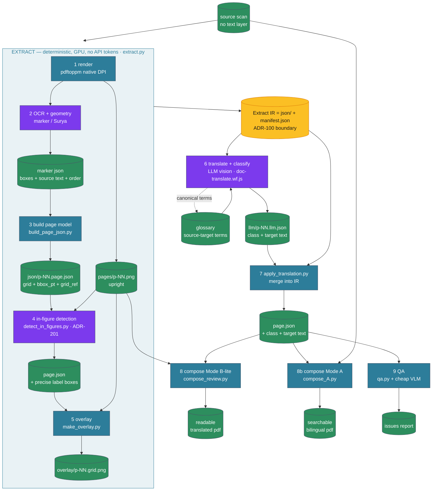
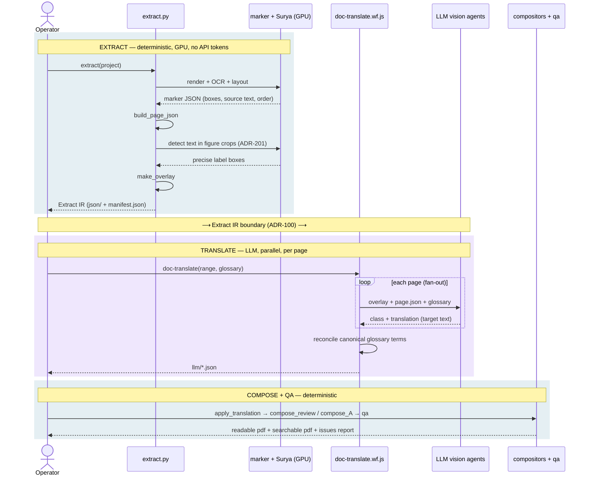
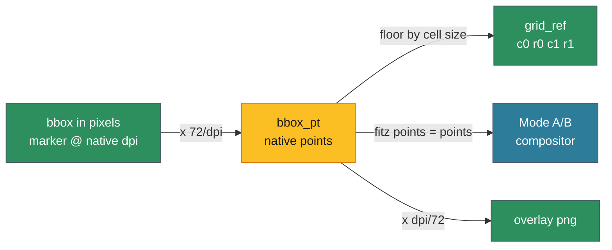
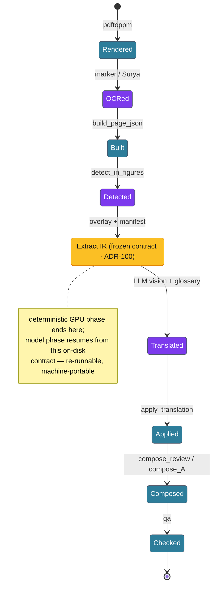

# Palimpsest Pipeline — Flow

How a scanned page in any language becomes a searchable, layout-preserving,
translated artifact. This is the **flow** companion to [`spec/SPEC.md`](../spec/SPEC.md)
(the detailed data model) and [`spec/schema.page.json`](../spec/schema.page.json)
(the contract). It is document-agnostic: any technical document of text and
figures — manuals, specs, reports — flows through the same stages.

## One-line mental model

> The scan is the truth for *pixels*. Marker/Surya is the truth for *geometry*.
> The LLM is the truth for *meaning* (translation + class). Compositors are dumb
> and deterministic — they only place what the JSON already says.

The LLM never invents coordinates and never draws. That separation is the whole
design: geometry comes from OCR (which is good at it), meaning comes from the
model (which is good at it), and rendering is reproducible.

## The Extract IR boundary (ADR-100)

The pipeline has a hard seam between a **deterministic Extract stage** (render +
OCR + detection + geometry, GPU-bound, no API tokens) and an **LLM Translate
stage**. The seam is a frozen on-disk contract — the *Extract IR*: per-page
`json/p-NNNN.page.json` + `manifest.json`, validated against
[`spec/schema.page.json`](../spec/schema.page.json). Everything left of the seam
is reproducible from the source PDF alone; everything right of it consumes the IR.
This is what lets the expensive translate pass be re-run, resumed, or swapped to a
different model without re-extracting, and lets the deterministic phase run
end-to-end on a local GPU before any model is called.

## The flow

Colour legend (consistent across every diagram below): **teal** = deterministic
stage · **violet** = model (ML / LLM) inference · **amber** = the frozen Extract
IR contract · **green** = data store / output artifact · **slate** = operator.



## Stages

| # | Stage | Engine | Kind | In → Out |
|---|-------|--------|------|----------|
| 1 | Render | `pdftoppm` | deterministic | PDF page → `pages/p-NN.png` @ native DPI (upright) |
| 2 | OCR + geometry | marker / Surya | ML (GPU) | page → marker JSON (boxes + sv text + reading order) |
| 3 | Build page model | `build_page_json.py` | deterministic | marker JSON → `json/p-NN.page.json` (grid + `bbox_pt` + `grid_ref` + `lang.sv`) |
| 4 | **In-figure detection** | `detect_in_figures.py` (Surya) | ML (GPU) | figure crops → precise label boxes appended (`source: surya-figure`, `class: label`) — ADR-201 |
| 5 | Overlay | `make_overlay.py` | deterministic | page.json + png → `overlay/p-NN.grid.png` (grid + numbered boxes) |
| — | **Extract IR boundary** | — | contract | `json/` + `manifest.json`, schema-validated — ADR-100 |
| 6 | **Translate + classify** | `doc-translate.wf.js` (LLM vision) | model | overlay + page.json + glossary → `llm/p-NN.llm.json` (`class`, `translate`, `lang.en`) |
| 7 | Apply translation | `apply_translation.py` | deterministic | llm.json → merged back into `json/p-NN.page.json` |
| 8 | Compose Mode B-lite | `compose_review.py` (PyMuPDF) | deterministic | upright png + page.json → readable translated PDF (white-out + render in place) |
| 8b| Compose Mode A | `compose_A.py` (PyMuPDF) | deterministic | scan + page.json → searchable PDF (invisible text layer) |
| 9 | QA | `qa.py` + cheap VLM | deterministic + model | page.json + output → issues report |

Stages 1–5 are driven end-to-end by `engine/scripts/extract.py`. Stage 6 is a
Claude Code Workflow (parallel vision agents, one per page, + glossary reconcile).

### Who calls what, in order

The same pipeline seen as an interaction over time — note the handoff at the
Extract IR boundary, where the deterministic GPU phase ends and the model phase
begins. The two halves run at different times and can be on different machines.

Phase bands follow the legend: teal-tinted = deterministic, violet-tinted = model.



## Why two "Claude" reads collapsed to one — and why geometry is model-free

The original idea had the model read polygon corners off a painted grid. VLMs are
unreliable at coordinate regression, so we inverted it:

- **Geometry is deterministic** — marker/Surya emit boxes + reading order
  (stage 2), and a second Surya pass recovers the labels *inside* exploded-view
  figures that marker collapses into a single `Picture` block (stage 4, ADR-201).
  Stage 3 converts everything to the canonical frame.
- **The grid is a *shared vocabulary*, not a measuring tape** — it's painted on
  the overlay (stage 5) so the model can *refer* to a region ("untranslated text
  near c3,r19") and a human can eyeball placement. Coordinates always resolve from
  the OCR boxes, never from the model's reading of the grid (ADR-101). The
  grid-recovery path survives only as a rare fallback for text with no box at all.

## The canonical frame (where the grid lives)

One coordinate space: **PDF native points, top-left origin**. The grid is defined
in that space (always against the PDF's native resolution — never an arbitrary
raster size). Each block carries both:

- `bbox_pt` — exact rectangle in points (the truth)
- `grid_ref` `{c0,r0,c1,r1}` — the cell rectangle it occupies (legible, diffable, LLM-facing)

Raster ↔ points is a pure scale by `dpi/72`, so the overlay PNG, the OCR boxes,
and the compositor all agree without drift.



## The data unit: one block

```jsonc
{
  "uid": "d1-f1-s067-b03",           // stable: del-flik-sida-blockindex (figure labels: ...-fNN)
  "order": 3,                          // reading order on the page
  "source": "marker",                  // "marker" | "surya-figure" (in-figure detection)
  "bbox_pt": [72.4, 410.1, 280.9, 455.6],
  "grid_ref": {"c0": 2, "r0": 16, "c1": 11, "r1": 18},
  "class": "step",                    // prose|heading|step|warning|caption|label|part_number|identifier|header_band|table|other
  "translate": true,                   // false => copy verbatim (part numbers stay byte-identical)
  "lang": {                            // XLIFF-like unit; source lang + targets
    "sv": "<source-language text as OCR'd>",
    "en": "<target-language translation>"
    // more targets added later against the SAME uid — no re-segmentation
  }
}
```

## Composition: masking & legibility (Mode B-lite)

`compose_review.py` is built and is the default human-readable output. Three
deterministic concerns it handles:

- **Build from the upright render, not the source PDF.** Scanned pages often
  carry a `/Rotate` flag, while marker boxes live in upright space. Composing over
  `pages/p-NN.png` (already upright) is immune to rotation — never composite over
  the rotated source.
- **Content-aware auto-trap masking (ADR-202).** Each white mask grows outward
  one pixel-line at a time *while that line still has ink*, stopping at the first
  clean line, hard-capped at `--trap-cap` (default 6 pt). This covers glyphs that
  spill past the OCR box without bleeding white notches onto adjacent diagram
  strokes. A fixed margin (`--fixed-trap --trap-x/--trap-y`) remains as a fallback.
- **One uniform body font per page.** `prose` + `step` blocks share a single size
  (median of per-box fits, clamped 6.5–11 pt) so the text doesn't jump line to
  line; headings render bold and may grow right/down into the gap before the next
  block. Labels render as a single centred line over their detected box.

## Mode B-lite now, full Mode B later — same JSON

- **Mode A** (`compose_A.py`): keep the scan, add invisible per-language text
  behind it → searchable/queryable in any stored language; no text-fitting
  problem; the standard OCR "sandwich". (Follow-up: honour `/Rotate` for the
  invisible layer — currently text is misplaced on rotated pages, low priority
  since it's invisible.)
- **Mode B-lite** (`compose_review.py`, built): whites out the source regions and
  renders the target text in place over the upright scan, with auto-trap +
  uniform font as above. The deferred *full* Mode B (ADR-202 §2) adds an optional
  vision trap-verification polish pass, built only if auto-trap shows residual
  under/over-trap.

Switching modes is a compositor swap, not a re-processing of the document — both
read the same `page.json`.

## Per-page artifact lifecycle (idempotent + resumable)

Each page is independent and advances through a fixed sequence of states;
re-running a stage overwrites only its own artifact, so a large multi-page run is
restartable and fans out trivially. Seen as the lifecycle of a single page:


