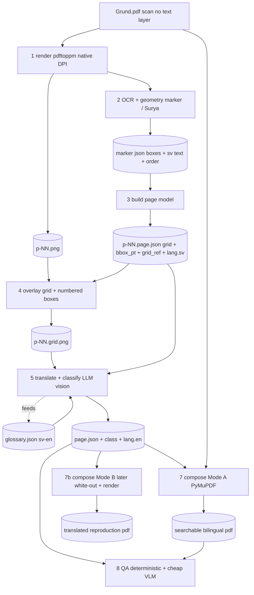
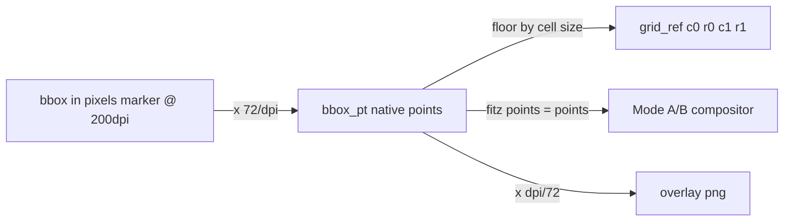

# C303 Manual Pipeline — Flow

How a scanned Swedish page becomes a searchable, translatable artifact. This is
the **flow** companion to [`spec/SPEC.md`](../spec/SPEC.md) (the detailed data
model) and [`spec/schema.page.json`](../spec/schema.page.json) (the contract).

## One-line mental model

> The scan is the truth for *pixels*. Marker is the truth for *geometry*. The
> LLM is the truth for *meaning* (translation + class). Compositors are dumb and
> deterministic — they only place what the JSON already says.

The LLM never invents coordinates and never draws. That separation is the whole
design: geometry comes from OCR (which is good at it), meaning comes from the
model (which is good at it), and rendering is reproducible.

## The flow



## Stages

| # | Stage | Engine | Kind | In → Out |
|---|-------|--------|------|----------|
| 1 | Render | `pdftoppm` | deterministic | PDF page → `pages/p-NN.png` @ native DPI |
| 2 | OCR + geometry | marker / Surya | ML | page → marker JSON (boxes + sv text + reading order) |
| 3 | Build page model | `build_page_json.py` | deterministic | marker JSON → `json/p-NN.page.json` (grid + `bbox_pt` + `grid_ref` + `lang.sv`) |
| 4 | Overlay | `make_overlay.py` | deterministic | page.json + png → `overlay/p-NN.grid.png` (grid + numbered boxes) |
| 5 | **Translate + classify** | **LLM vision** | model | overlay + page.json + glossary → fills `class`, `translate`, `lang.en` |
| 6 | Glossary | accumulate/normalize | deterministic + model | terms ↔ `glossary.json`, fed back into 5 |
| 7 | Compose Mode A | `compose_A.py` (PyMuPDF) | deterministic | scan + page.json → `out/*.A.pdf` (invisible text layer) |
| 7b| Compose Mode B *(later)* | PyMuPDF + inpaint | deterministic | scan + page.json → visual reproduction |
| 8 | QA | `qa.py` + cheap VLM | deterministic + model | page.json + output → issues report |

## Why two passes of "Claude" but only one is geometry-free

The original idea was to have the model read polygon corners off a painted grid.
VLMs are unreliable at coordinate regression, so we inverted it:

- **Geometry is deterministic** — marker/Surya already emit boxes + reading
  order. Stage 3 converts those to the canonical frame.
- **The grid is a *shared vocabulary*, not a measuring tape** — it's painted on
  the overlay (stage 4) so the model can *refer* to a region ("untranslated text
  near c3,r19") and so a human can eyeball placement. Coordinates still resolve
  from the OCR boxes, never from the model's reading of the grid.

## The canonical frame (where the grid lives)

One coordinate space: **PDF native points, top-left origin**. The grid is defined
in that space (per spec, always against the PDF's native resolution — never an
arbitrary raster size). Each block carries both:

- `bbox_pt` — exact rectangle in points (the truth)
- `grid_ref` `{c0,r0,c1,r1}` — the cell rectangle it occupies (legible, diffable, LLM-facing)

Raster ↔ points is a pure scale by `dpi/72`, so the overlay PNG, the OCR boxes,
and the compositor all agree without drift.



## The data unit: one block

```jsonc
{
  "uid": "d1-f1-s067-b03",         // stable: del-flik-sida-blockindex
  "order": 3,                        // reading order on the page
  "bbox_pt": [72.4, 410.1, 280.9, 455.6],
  "grid_ref": {"c0": 2, "r0": 16, "c1": 11, "r1": 18},
  "class": "step",                  // prose|heading|step|warning|caption|label|part_number|identifier|header_band|table|other
  "translate": true,                 // false => copy verbatim (part numbers stay byte-identical)
  "lang": {                          // XLIFF-like unit; sv source, others targets
    "sv": "Ta bort proppen och fjädern på ena sidan.",
    "en": "Remove the plug and spring on one side."
    // "de", "es" added later against the SAME uid — no re-segmentation
  }
}
```

## Per-page artifact lifecycle (idempotent + resumable)

Each page is independent; re-running a stage overwrites only its own artifact, so
the full 1028-page run is restartable and fans out trivially.

```
pages/p-NN.png  →  marker/*.json  →  json/p-NN.page.json
                                          │
                        overlay/p-NN.grid.png ─┐
                                          │     ├─► (LLM) json/p-NN.page.json [+en +class]
                              glossary.json ────┘            │
                                                  out/p-NN.A.pdf   qa/p-NN.json
```

## Mode A now, Mode B later — same JSON

- **Mode A** (building first): keep the scan, add invisible per-language text
  behind it → searchable/queryable in any stored language; no text-fitting
  problem; the standard OCR "sandwich".
- **Mode B** (later): same page.json drives a different compositor that whites
  out / inpaints the Swedish regions and renders the target text in place
  (shrink-to-fit, leader-labels stay anchored).

Switching modes is a compositor swap, not a re-processing of the book.
